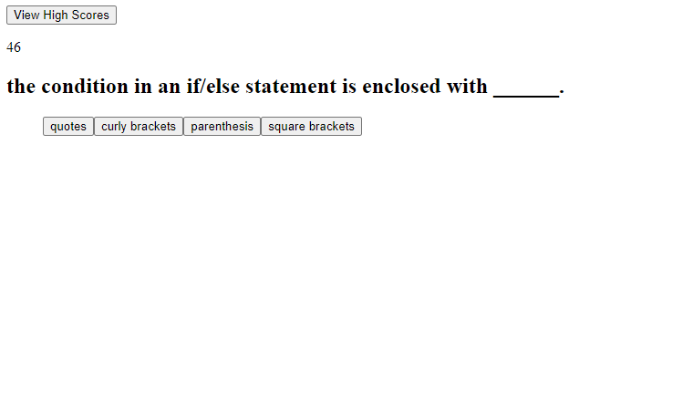

# Ultimate Coding Quiz

## Purpose
A quiz in which to test your knowledge on the fundementals of Javascript (and to test my efficiency with it)

## Instructions
Clicking the start button will begin the quiz, and the timer. Get a question wrong, you lose 10 seconds.
Your time remaining would be your high score.

## Built with
*HTML

*~~CSS~~

*Javascript

## Website
https://eucalyptus1.github.io/ultimate-coding-quiz/

## Contribution
Made by James

